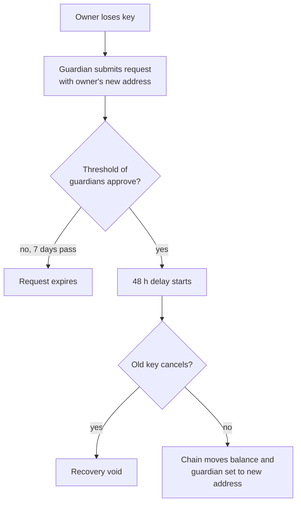

# Trefoil (TFL) — Design

*Last updated: 18 September 2026. Living document; the prototype changes it and it changes the prototype.*

## The pitch

Trefoil is a coin you can't lose. Every account on this chain has key recovery built in: if you lose your phone or your seed phrase, the guardians you chose can restore access, and no company ever holds your coins.

The problem is real and unsolved at chain level. Around 16% of crypto holders have lost access to their holdings through lost keys, forgotten passwords or frozen accounts, and "no protection" is the second-biggest reason non-holders stay away. Ethereum offers recovery only as optional add-on wallets that most people never set up. Here it is the default for every account, free, and supported by every wallet on the chain.

One sentence for a stranger: *"It's crypto where losing your password isn't the end."*

The name is the three-loop knot — three interlocking rings, none can be pulled free without the others — which is the guardian model in a picture.

## The coin

| Parameter | Value | Why |
| --- | --- | --- |
| Name / ticker | Trefoil / TFL (base unit `utfl`, 1 TFL = 1,000,000 utfl) | No existing token or chain found under this name |
| Initial supply | 100,000,000 TFL | Round numbers, human-sized balances |
| Transaction fee | 0 | Feels like a normal app; matches the pitch |
| Inflation | 7%/yr at launch, falling toward 2% as staking rises | Pays validators and stakers instead of fees |
| Where inflation goes | ~90% to validators and their stakers, ~10% to community pool | Security first, a treasury for grants second |
| Spam control | Per-account rate limit, block size cap | Zero fees need another brake on abuse |

The trade-off to say out loud: holders who don't stake are diluted ~7%/yr. Staking should be one click in the wallet, so the default experience is "your coins earn" rather than "your coins shrink".

## Genesis allocation (proposed)

Weighted toward the people who help launch it rather than the founder. Starting points to argue with, not decisions.

| Who | Share | Vesting |
| --- | --- | --- |
| Testnet participants and early validators | 30% | 25% at launch, rest over 12 months |
| Community pool (grants, bounties, future airdrops) | 30% | Spent only by governance vote |
| Founder | 15% | 1-year cliff, then over 3 years |
| Future core contributors | 15% | Held by the pool until people join |
| Public launch / liquidity | 10% | Unlocked at launch |

For the local prototype none of this matters: `config.yml` hands everything to a few test accounts. The split becomes real at the first public testnet.

## Account recovery

Default: 3 guardians, any 2 approve, 48-hour delay before the switch. Guardians can never spend; the only power they hold is a vote to move the account.

| Rule | Value |
| --- | --- |
| Guardians per account | 3 by default (min 1, max 7) |
| Approvals needed | Strict majority (2 of 3, 3 of 5) |
| Recovery delay | 48 h after the threshold is met (60 s on the local dev chain) |
| Request expiry | 7 days unapproved (1 h locally) |
| Cancel during delay | Original key, one transaction |
| Changing guardians | Blocked while a recovery is pending |
| Guardian types | Any chain account: a friend, your own second device, or a recovery service |

Recovery needs both a majority of guardians *and* 48 hours of silence from the old key, so a thief who holds your phone can't finish a takeover before you notice, and colluding guardians can't act while you still have your key.

**Prototype v1 decisions (17 Sep 2026):**
- Recovery moves the account's full liquid balance to a *new address* and carries the guardian set across, rather than keeping the same address. Same-address recovery (rotating the key underneath an address) needs wallet support that doesn't exist yet; it is the v2 design.
- The request is submitted by a guardian on the owner's behalf (a brand-new wallet can't sign yet) and counts as the first approval.
- Staked coins stay on the old address; unstaking them is a v2 job.

**Safe destinations (v1.1, 18 Sep 2026):** an account may pre-register backup addresses. If any are set, a recovery can only send funds to one of them. Guardians still trigger and approve, but no longer choose where the money goes — so colluding guardians gain nothing.

Module: `x/recovery`. Messages: `SetGuardians`, `RequestRecovery`, `ApproveRecovery`, `CancelRecovery`, `SetSafeDestinations`. An end-of-block hook executes recoveries whose delay has elapsed and drops expired requests.

## Consensus and validators

Proof-of-stake on CometBFT via the Cosmos SDK (v0.53): nothing custom here, on purpose. The novelty budget is spent entirely on recovery.

- Block time ~5 s; a transaction is final in one block.
- Slashing: SDK defaults (double-sign, downtime).
- Local prototype: 1 validator. Public testnet: 5–10. Mainnet target: 30+ before anyone is asked to hold real value.
- Upgrades are proposed and voted on-chain, then applied at an agreed block height.

## Out of scope for the prototype

Real ideas, each of which would double the work. Parked, not rejected.

- Smart contracts (CosmWasm)
- Reversal window for stolen funds — legally heavy
- IBC connections to other chains — easy to switch on later
- Post-quantum signatures — needs specialist review
- Mobile wallet — the CLI is enough to prove the flow
- Any token sale, exchange listing or public marketing

## Definition of done (prototype)

- [x] Chain starts from one command and produces blocks
- [x] Coins move between accounts with zero fee
- [x] An account sets three guardians
- [x] Its key is deleted on purpose
- [x] A guardian requests recovery to a new address; a second approves
- [x] The original key can cancel inside the delay (proven on the live chain, 18 Sep 2026)
- [x] After the delay, the balance and guardian set are on the new address
- [x] One guardian alone cannot trigger recovery
- [x] Automated tests cover all of the above and pass (`go test ./x/recovery/...`)

## Roadmap

1. ~~Public GitHub repo~~ (done, 18 Sep 2026)
2. ~~Safe-destination addresses (v1.1)~~ (done, 18 Sep 2026)
3. Multi-node local testnet: prove 3–5 validators agree and survive one going down
4. Small public testnet with volunteer validators; incentivised by the participant allocation
5. A real wallet with guardian setup in onboarding — where the pitch becomes visible
6. Same-address recovery (v2)
7. Legal review before any coin has value or is offered to the public
8. Mainnet genesis

## Open questions and risks

- **Legal.** Promoting crypto to the UK public is FCA-regulated, and a coin people expect to rise can be treated as a security. Get advice before step 7; a local prototype has no exposure. Not legal advice.
- **Guardian collusion.** Two guardians plus a stolen phone within 48 h is the failure case. Mitigations: safe destinations (v1.1); one guardian being your own second device; wallets notifying the owner on every recovery request.
- **Guardians who vanish.** With 3 guardians, losing two makes recovery impossible. The wallet should prompt a guardian check-in periodically.
- **Adoption.** The technology is the easy part. Nothing here gets users; the wallet in roadmap step 5 is the first thing a normal person would ever see.
- **Inflation optics.** "7% a year" reads badly if not framed as staking yield.
- **Name.** Domain availability and a trademark search still to do before public launch.

## Sources

- [Security.org — 2026 crypto consumer report](https://www.security.org/digital-security/cryptocurrency-annual-consumer-report/) (16% lost access; protection concerns)
- [PYMNTS — Fed report on everyday crypto use](https://www.pymnts.com/cryptocurrency/2026/the-federal-reserve-confirms-crypto-as-money-hasnt-happened-yet/)
