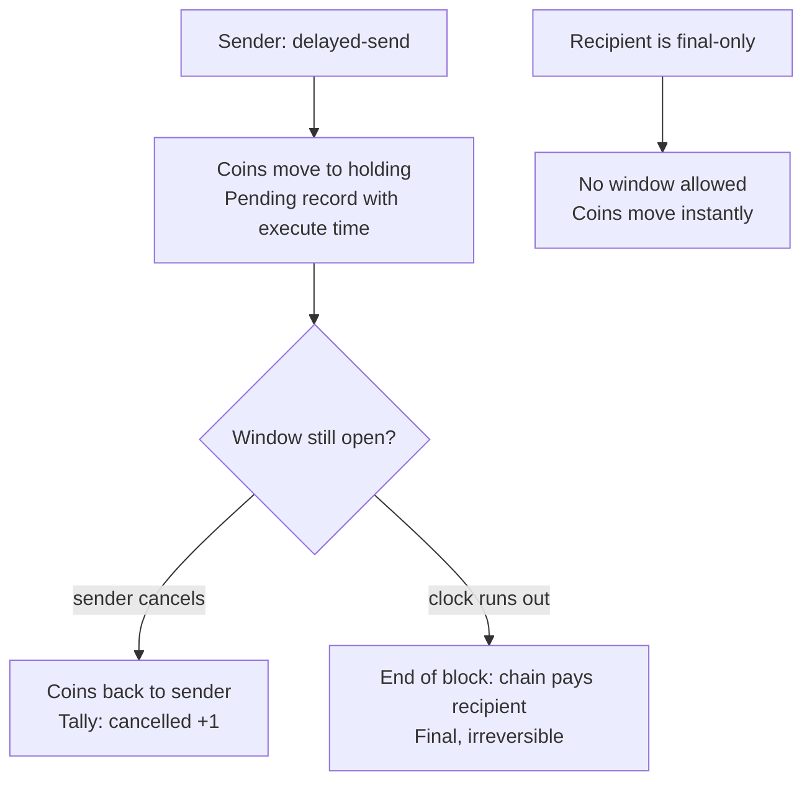

# Trefoil (TFL) — Design

*Last updated: 19 September 2026. Living document; the prototype changes it and it changes the prototype.*

## The pitch

Trefoil is the coin with an undo button. Every payment has a short countdown before it becomes final; until then the sender can take it back. After that it is final for everyone, forever — there is no company, arbiter or validator who can reverse it.

The problem is real and unsolved at chain level. One academic study put losses from address mistakes on Ethereum and BNB Chain alone at around $575M. Every chain treats "sent to the wrong address" as the user's problem; the two prior attempts at undo were a third-party add-on (Kirobo, 2021, which needed both sides to use its app) and a proposal by a stablecoin company to reverse transactions itself (Circle, 2025, which the market read as chargebacks). Trefoil's version is native, sender-only, and expiring: the chain enforces it, nobody adjudicates it, and a payment that has become final cannot be touched by anyone.

One sentence for a stranger: *"It's crypto where sending to the wrong address isn't the end."*

The name is the three-loop knot: send, wait, final.

## How it got here

Trefoil began (17–19 Sep 2026) as *a wallet you can't lose*: guardian-based recovery built into every account, with a 48-hour veto, safe destinations and a zero-coin sign-up path. All of it was built, tested and proven on a live chain. The flaw was in the onboarding, not the cryptography: every new user had to nominate three guardians before doing anything, and on a chain with no users yet that meant generating and writing down four seed phrases at sign-up. The delay-and-cancel machinery underneath was reused for a problem one person can solve alone. The recovery module lives in git history.

## The coin

| Parameter | Value | Why |
| --- | --- | --- |
| Name / ticker | Trefoil / TFL (base unit `utfl`, 1 TFL = 1,000,000 utfl) | No existing chain under this name; "UNDO" as a ticker is taken by an unrelated token |
| Initial supply | 100,000,000 TFL | Round numbers, human-sized balances |
| Transaction fee | 0 | Feels like a normal app; matches the pitch |
| Inflation | 7%/yr at launch, falling toward 2% as staking rises | Pays validators and stakers instead of fees |
| Where inflation goes | ~90% to validators and their stakers, ~10% to community pool | Security first, a treasury for grants second |
| Spam control | Per-account cap on pending sends, block size cap | Zero fees need another brake on abuse |

The trade-off to say out loud: holders who don't stake are diluted ~7%/yr. Staking should be one click in the wallet, so the default experience is "your coins earn" rather than "your coins shrink".

## Genesis allocation (proposed)

Weighted toward the people who help launch it rather than the founder. Starting points to argue with, not decisions.

| Who | Share | Vesting |
| --- | --- | --- |
| Testnet participants and early validators | 30% | 25% at launch, rest over 12 months |
| Community pool (grants, bounties, future airdrops) | 30% | Spent only by governance vote |
| Founder | 15% | 1-year cliff, then over 3 years |
| Future core contributors | 15% | Held by the pool until people join |
| Public launch / liquidity | 10% | Unlocked at launch |

For the local prototype none of this matters: `config.yml` hands everything to a few test accounts. The split becomes real at the first public testnet.

## Undo

| Rule | Value |
| --- | --- |
| Minimum window | 2 minutes — every payment waits at least this long |
| Default window | 10 minutes (what you get if you don't choose) |
| Maximum window | 24 hours |
| Who can undo | The sender only, before the window closes |
| Where the coins sit meanwhile | The undo module's holding account — not the sender's, not the recipient's |
| Pending sends per address | 20 in flight at once |
| Recipient opt-out | `set-final-only`: payments to this address have no window and land instantly |
| Public tally | Every address: sends started, sends cancelled |

**The bait problem.** "Look, the payment's coming" → goods handed over → cancel. It cannot be removed while undo exists; it can be made an unforced error rather than a trap:

1. Pending is never money. The wallet shows incoming pending as *promised, not yours yet — don't hand anything over*; the balance does not move until final.
2. Final-only mode for anyone who hands over goods on the spot. The chain refuses undoable sends to such an address, and the sender's wallet warns before sending.
3. The tally is public. Serial cancellers build a visible record, and wallets warn before you deal with one.

**Prototype v1 decisions (19 Sep 2026):**
- Window 0 in a send means "chain default", except to a final-only address, where 0 is the sender's explicit acknowledgement that the payment is instant. A non-zero window to a final-only address is refused.
- Pending sends already in flight when an address turns on final-only finish under the rules they started with.
- The per-address cap is a walk over the pending table; fine for a prototype, an index for a real deployment.
- The tally is a plain counter. Time-decay, ratios and warnings are wallet policy, not chain rules.

Module: `x/undo`. Messages: `DelayedSend`, `CancelSend`, `SetFinalOnly`. An end-of-block hook pays out sends whose window has closed.

## Consensus and validators

Proof-of-stake on CometBFT via the Cosmos SDK (v0.53): nothing custom here, on purpose. The novelty budget is spent entirely on undo.

- Block time ~5 s; a transaction is final in one block; a payment is final when its window closes.
- Slashing: SDK defaults (double-sign, downtime).
- Local prototype: 1 validator (`chain serve`) or 4 (`testnet multi-node`). Public testnet: 5–10. Mainnet target: 30+ before anyone is asked to hold real value.
- Upgrades are proposed and voted on-chain, then applied at an agreed block height.

## Out of scope for the prototype

Real ideas, each of which would double the work. Parked, not rejected.

- **Spending vault** — a daily limit; anything above it is a 24-hour cancellable send to yourself. Same engine; protects against a stolen phone.
- **Inheritance** — a claim that goes through if the account is silent for a year. Same engine, one heir.
- **Guardian recovery** — built, proven, shelved for onboarding cost. In git history.
- Smart contracts (CosmWasm), IBC connections, post-quantum signatures, mobile app, any token sale or listing.

## Definition of done (prototype)

- [x] Chain starts from one command and produces blocks
- [x] Coins move between accounts with zero fee
- [x] A send with a window parks the coins; the recipient's balance does not change
- [x] The sender can cancel inside the window and the coins come back
- [x] Nobody but the sender can cancel
- [x] When the window closes the chain pays out by itself; a later cancel is refused (proven live, 19 Sep 2026)
- [x] Windows outside min/max are refused; 0 means default
- [x] A final-only address refuses undoable sends and is paid instantly with window 0 (proven live, 19 Sep 2026)
- [x] The tally counts sends and cancels
- [x] One address cannot exceed the pending cap
- [x] Automated tests cover all of the above and pass (`go test ./x/undo/...`)
- [x] Runs as a 4-validator network; survives one node down, pauses safely at two, resumes
- [ ] The wallet shows the countdown, the Undo button, and pending-in as "not yours yet"

## Roadmap

1. ~~Public GitHub repo~~ (done)
2. ~~Multi-node local testnet~~ (done — 4 validators; lost one and kept going, lost two and paused, recovered)
3. ~~Undo module on the chain, proven live~~ (done, 19 Sep 2026)
4. Wallet with undo: send with countdown, Undo button, pending-in shown as promised, shop switch in settings, tally shown before you send
5. Small public testnet with volunteer validators; incentivised by the participant allocation
6. Spending vault (same engine, second feature)
7. Legal review before any coin has value or is offered to the public
8. Mainnet genesis

## Open questions and risks

- **Legal.** Promoting crypto to the UK public is FCA-regulated, and a coin people expect to rise can be treated as a security. Get advice before step 7; a local prototype has no exposure. Not legal advice.
- **No instant payments** except to final-only addresses. A deliberate choice — the 2-minute floor is what makes "every payment can be undone" true — but it means merchants must opt in. If that bites in practice, a recipient-side "accept instantly" is a small change.
- **Bait-and-cancel.** Mitigated (above), not eliminated. The wallet copy matters as much as the chain rules.
- **Adoption.** The technology is the easy part. Nothing here gets users; the wallet in roadmap step 4 is the first thing a normal person would ever see.
- **Inflation optics.** "7% a year" reads badly if not framed as staking yield.
- **Name.** Domain availability and a trademark search still to do before public launch.

## Sources

- [Crypto 'address misuse' drained $574.8M in ETH and BNB — USENIX study](https://ambcrypto.com/crypto-address-misuse-drained-574-8m-in-eth-and-bnb-usenix-study/)
- [Kirobo's undo button (2021)](https://www.crowdfundinsider.com/2021/07/177764-kirobos-undo-button-is-said-to-have-saved-users-6-million-in-crypto/)
- [Circle examines reversible transactions (2025)](https://www.coindesk.com/business/2025/09/25/circle-examines-ways-to-reverse-transactions-to-counter-fraud-disputes-ft)
- [Security.org — 2026 crypto consumer report](https://www.security.org/digital-security/cryptocurrency-annual-consumer-report/) (original recovery research)
